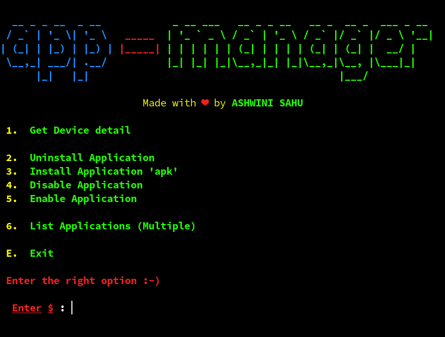
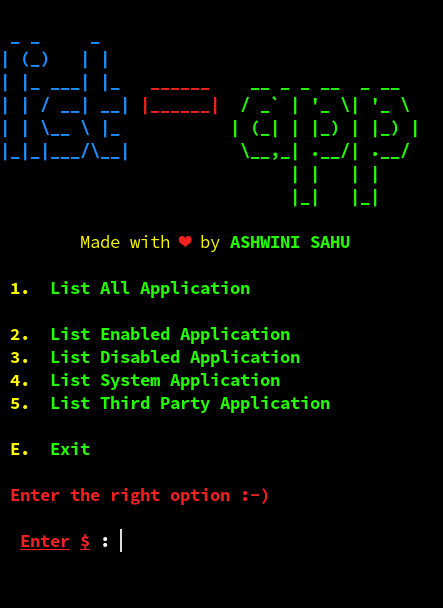

<div align="center" markdown="1">

[](https://www.gnu.org/licenses/gpl-3.0)
[](https://gitHub.com/ASHWIN990/app-manager/graphs/commit-activity)
[](https://www.gnu.org/software/bash/)
[](https://ashwini.codes)

</div>

<p align="center">
    <a href="https://github.com/ASHWIN990/app-manager">
        <br>
    </a>
  </p>

<h3 align="center">Manage Android application in GNU/Linux (CLI) 🖥️</h3>

<p markdown="1">

**app-manager** is a BASH Script to handle **_Android Application_** from the fancy of your terminal screen, i got the idea of it when i wanted to disable some non uninstallable _bloatware_ so i had to take the help of _ADB_ and it worked great and now i'm shraing this to all.

</p>

## Functions

```
1. Get Device Detail
2. Uninstall Application
3. Install Application 'apk'
4. Disable Application
5. Enable Application

6. List Applications (Multiple)
    6.1. List All Application
    6.2. List Enabled Application
    6.3. List Disabled Application
    6.4. List System Application
    6.5. List Third Party Application
```

## Installation

**Arch linux** and **Arch based distro** (**_AUR_**)

- yay -S [app-manager](https://aur.archlinux.org/packages/app-manager/)

**Normal Installation**

```bash
git clone https://github.com/ASHWIN990/app-manager.git

cd app-manager

sudo chmod +x app-manager
```

## Usage

```bash
# Go to the directory where you cloned the app-manager repo

./app-manager

# or you can do

bash app-manager
```

## Options

```bash
-s, --serial <Serial No.>   Pass the serial number of device.

-h, --help                  Print the Help message.
```

## Screenshots

<p align="center">
    </img>
    </img>
</p>

## Contributing

Pull requests are welcome. For major changes, please open an issue first to discuss what you would like to change.

## Support Me

<a href="https://www.buymeacoffee.com/ashwinisahu" target="_blank"></a>

## Author

* **[ASHWINI SAHU](https://ashwini.codes)**
* **Email me at : *ashwinisahu990@gmail.com***
* **Follow me at : *[Instagram](https://instagram.com/kumar_ashwin_sahu) , [Twitter](https://twitter.com/ashwinisahu990)***