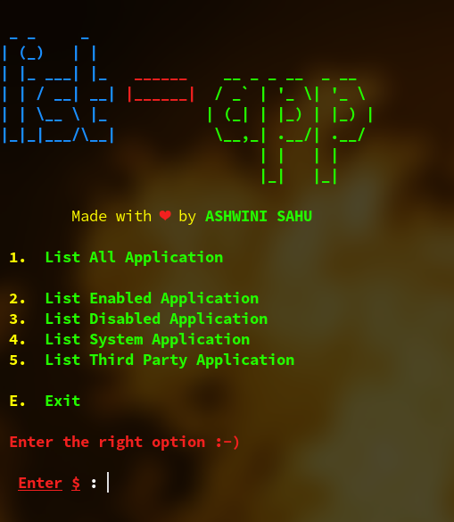

<h1 align="center">app-manager</h1>

<div align="center" markdown="1">

[](https://www.gnu.org/licenses/gpl-3.0)
[](https://gitHub.com/ASHWIN990/app-manager/graphs/commit-activity)
[![made-with-bash](https://img.shields.io/badge/-Made%20with%20Bash-1f425f.svg?logo=image%2Fpng%3Bbase64%2CiVBORw0KGgoAAAANSUhEUgAAABgAAAAYCAYAAADgdz34AAAAGXRFWHRTb2Z0d2FyZQBBZG9iZSBJbWFnZVJlYWR5ccllPAAAAyZpVFh0WE1MOmNvbS5hZG9iZS54bXAAAAAAADw%2FeHBhY2tldCBiZWdpbj0i77u%2FIiBpZD0iVzVNME1wQ2VoaUh6cmVTek5UY3prYzlkIj8%2BIDx4OnhtcG1ldGEgeG1sbnM6eD0iYWRvYmU6bnM6bWV0YS8iIHg6eG1wdGs9IkFkb2JlIFhNUCBDb3JlIDUuNi1jMTExIDc5LjE1ODMyNSwgMjAxNS8wOS8xMC0wMToxMDoyMCAgICAgICAgIj4gPHJkZjpSREYgeG1sbnM6cmRmPSJodHRwOi8vd3d3LnczLm9yZy8xOTk5LzAyLzIyLXJkZi1zeW50YXgtbnMjIj4gPHJkZjpEZXNjcmlwdGlvbiByZGY6YWJvdXQ9IiIgeG1sbnM6eG1wPSJodHRwOi8vbnMuYWRvYmUuY29tL3hhcC8xLjAvIiB4bWxuczp4bXBNTT0iaHR0cDovL25zLmFkb2JlLmNvbS94YXAvMS4wL21tLyIgeG1sbnM6c3RSZWY9Imh0dHA6Ly9ucy5hZG9iZS5jb20veGFwLzEuMC9zVHlwZS9SZXNvdXJjZVJlZiMiIHhtcDpDcmVhdG9yVG9vbD0iQWRvYmUgUGhvdG9zaG9wIENDIDIwMTUgKFdpbmRvd3MpIiB4bXBNTTpJbnN0YW5jZUlEPSJ4bXAuaWlkOkE3MDg2QTAyQUZCMzExRTVBMkQxRDMzMkJDMUQ4RDk3IiB4bXBNTTpEb2N1bWVudElEPSJ4bXAuZGlkOkE3MDg2QTAzQUZCMzExRTVBMkQxRDMzMkJDMUQ4RDk3Ij4gPHhtcE1NOkRlcml2ZWRGcm9tIHN0UmVmOmluc3RhbmNlSUQ9InhtcC5paWQ6QTcwODZBMDBBRkIzMTFFNUEyRDFEMzMyQkMxRDhEOTciIHN0UmVmOmRvY3VtZW50SUQ9InhtcC5kaWQ6QTcwODZBMDFBRkIzMTFFNUEyRDFEMzMyQkMxRDhEOTciLz4gPC9yZGY6RGVzY3JpcHRpb24%2BIDwvcmRmOlJERj4gPC94OnhtcG1ldGE%2BIDw%2FeHBhY2tldCBlbmQ9InIiPz6lm45hAAADkklEQVR42qyVa0yTVxzGn7d9Wy03MS2ii8s%2BeokYNQSVhCzOjXZOFNF4jx%2BMRmPUMEUEqVG36jo2thizLSQSMd4N8ZoQ8RKjJtooaCpK6ZoCtRXKpRempbTv5ey83bhkAUphz8fznvP8znn%2B%2F3NeEEJgNBoRRSmz0ub%2FfuxEacBg%2FDmYtiCjgo5NG2mBXq%2BH5I1ogMRk9Zbd%2BQU2e1ML6VPLOyf5tvBQ8yT1lG10imxsABm7SLs898GTpyYynEzP60hO3trHDKvMigUwdeaceacqzp7nOI4n0SSIIjl36ao4Z356OV07fSQAk6xJ3XGg%2BLCr1d1OYlVHp4eUHPnerU79ZA%2F1kuv1JQMAg%2BE4O2P23EumF3VkvHprsZKMzKwbRUXFEyTvSIEmTVbrysp%2BWr8wfQHGK6WChVa3bKUmdWou%2BjpArdGkzZ41c1zG%2Fu5uGH4swzd561F%2BuhIT4%2BLnSuPsv9%2BJKIpjNr9dXYOyk7%2FBZrcjIT4eCnoKgedJP4BEqhG77E3NKP31FO7cfQA5K0dSYuLgz2TwCWJSOBzG6crzKK%2BohNfni%2Bx6OMUMMNe%2Fgf7ocbw0v0acKg6J8Ql0q%2BT%2FAXR5PNi5dz9c71upuQqCKFAD%2BYhrZLEAmpodaHO3Qy6TI3NhBpbrshGtOWKOSMYwYGQM8nJzoFJNxP2HjyIQho4PewK6hBktoDcUwtIln4PjOWzflQ%2Be5yl0yCCYgYikTclGlxadio%2BBQCSiW1UXoVGrKYwH4RgMrjU1HAB4vR6LzWYfFUCKxfS8Ftk5qxHoCUQAUkRJaSEokkV6Y%2F%2BJUOC4hn6A39NVXVBYeNP8piH6HeA4fPbpdBQV5KOx0QaL1YppX3Jgk0TwH2Vg6S3u%2BdB91%2B%2FpuNYPYFl5uP5V7ZqvsrX7jxqMXR6ff3gCQSTzFI0a1TX3wIs8ul%2Bq4HuWAAiM39vhOuR1O1fQ2gT%2F26Z8Z5vrl2OHi9OXZn995nLV9aFfS6UC9JeJPfuK0NBohWpCHMSAAsFe74WWP%2BvT25wtP9Bpob6uGqqyDnOtaeumjRu%2ByFu36VntK%2FPA5umTJeUtPWZSU9BCgud661odVp3DZtkc7AnYR33RRC708PrVi1larW7XwZIjLnd7R6SgSqWSNjU1B3F72pz5TZbXmX5vV81Yb7Lg7XT%2FUXriu8XLVqw6c6XqWnBKiiYU%2BMt3wWF7u7i91XlSEITwSAZ%2FCzAAHsJVbwXYFFEAAAAASUVORK5CYII%3D)](https://www.gnu.org/software/bash/)
[](https://ashwini.codes)

</div>

<h3 align="center">Manage Android application in GNU/Linux (CLI) 🖥️</h3>

<p markdown="1">

**app-manager** is a BASH Script to handle ***Android Application*** from the fancy of your terminal screen, i got the idea of it when i wanted to disable some non uninstallable *bloatware* so i had to take the help of *ADB* and it worked great and now i'm shraing this to all.

</p>


## Funtions

```
1. Get Device Detail
2. Uninstall Application
3. Install Application 'apk'
4. Disable Application
5. Enable Application

6. List Applications (Multiple)
    6.1. List All Application
    6.2. List Enabled Application
    6.3. List Disabled Application
    6.4. List System Application
    6.5. List Third Party Application
```

## Installation

**Arch linux** and **Arch based distro** (***AUR***)

* yay -S [app-manager](https://aur.archlinux.org/packages/app-manager/)

**Normal Installation**

```bash
git clone https://github.com/ASHWIN990/app-manager.git

cd app-manager

sudo chmod +x app-manager
```

## Usage

```bash
# Go to the directory where you cloned the app-manager repo

./app-manager

# or you can do

bash app-manager
```


## Screenshots

<p align="center">
    </img>
    </img>
</p>


## Contributing

Pull requests are welcome. For major changes, please open an issue first to discuss what you would like to change.


## Support Me

<a href="https://www.buymeacoffee.com/ashwinisahu" target="_blank"></a>


## Author

* **ASHWINI SAHU** - *WHOLE WORK* - (https://ashwini.codes)